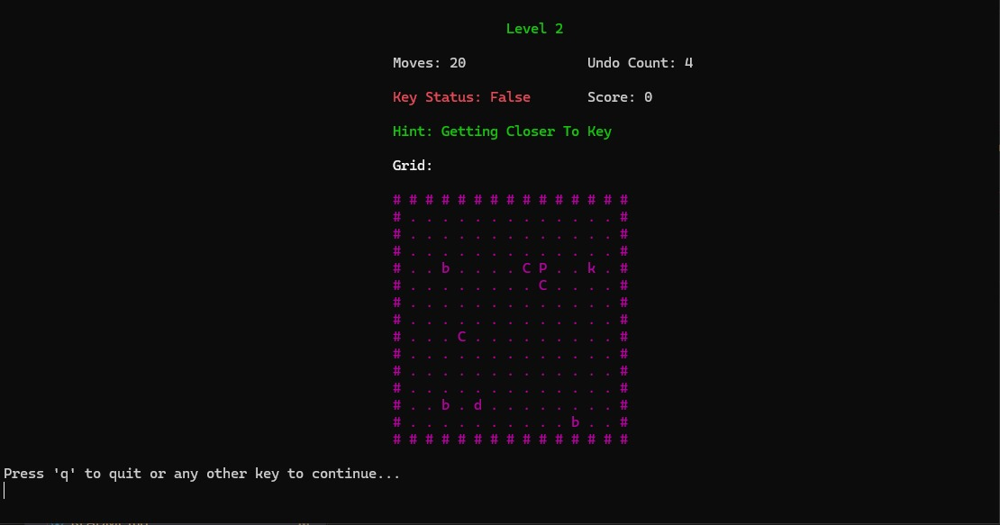
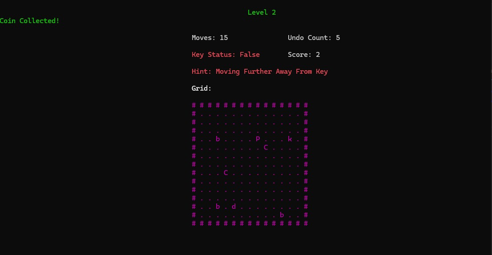
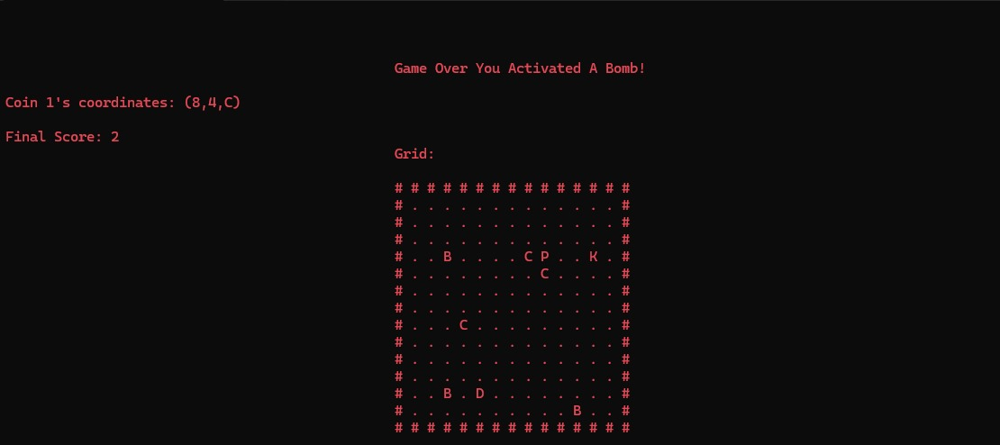
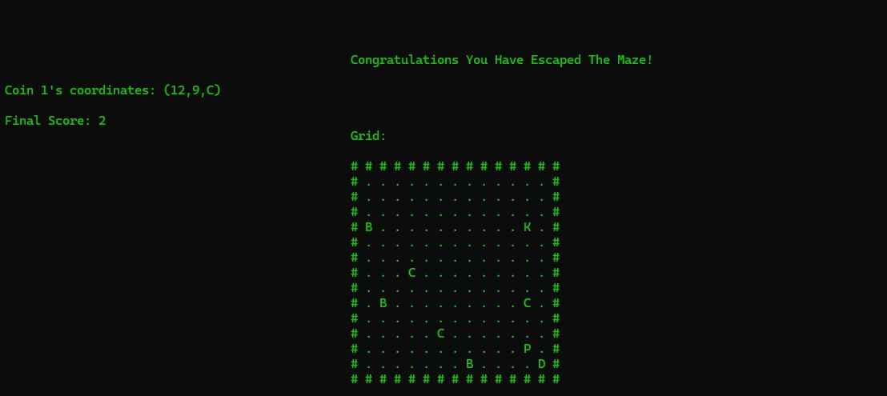

# **Unseen Journey Quest**

## **Description:**

Welcome to the Maze Game! navigate through a challenging path filled with twists,turns and hidden treasures, your
goal is to locate a hidden key, then find a hidden door and escape the maze. however the maze can be tricky you
can get lost, be trapped forever, or you can fall into a trap, you need to be cautious and patience, think before
you act, one wrong move could be your downfall, this game has multiple levels, where each level increases complexity 
of the maze testing your problem solving kills, decision making and patience.

## **Technologies Used:**

**1- Programming Language:** C++

**2- Libraries:** cstdlib, ctime, ncurses.h

**3- Data Structures:** Stack, Linked List

## **Key Features:**

1- A game grid that changes based on the level we are playing.

2- player,bomb,key,door and coin items placed randomly on the grid.

3- undo feature activated by user input.

4- calculated number of moves using manhattan distance logic.

5- ncurses styling, for a beautiful and user friendly display.

6- bomb proximity logic.

## Some Images of the Game in Action

**Initial Grid:**

**Coin Collection:**

**Game Loss Window:**

**Game Win Window:**

